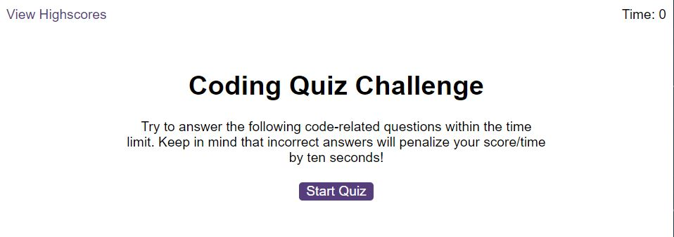

# PASSWORD GENERATOR

## Description
In this project I have created a logic with JavaScript for a quiz and a question aswell.

This is result:

## Installation
N/A

## Usage
When you will click "Start Quiz" button it will ask you some questions about JavaScript, after all questions answered it will give you a score and you can save it with your initials to localStorage.

Link to live page: [Click here](https://markubil.github.io/Coding-quiz/)

## Credits
N/A

## License
 GNU GENERAL PUBLIC LICENSE

 Version 3, 29 June 2007

 Copyright (C) 2007 Free Software Foundation, Inc. <https://fsf.org/>
 Everyone is permitted to copy and distribute verbatim copies
 of this license document, but changing it is not allowed.

## Badges

